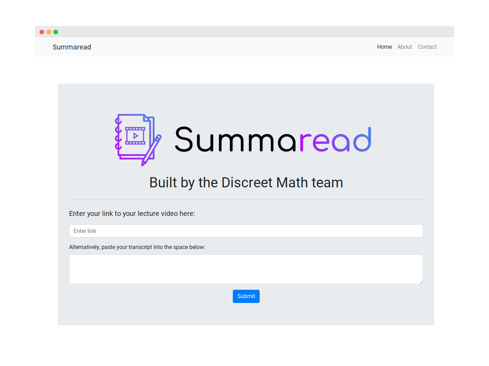

# SummaRead: From Video Lectures to Smart Note Outlines
### Hophacks Fall 2020 Overall 1st Place

Built by @brandonwang1, @senapathys, @matt-dong, and @arjunneervannan

Devpost: https://devpost.com/software/summawrite/



## Running Locally

Make sure you have Python installed

```sh
$ git clone https://github.com/matt-dong/summaread.git # or clone your own fork
$ cd summaread
$ pip install -r requirements.txt
$ python app.py
```

Your app should now be running on [localhost:5000](http://localhost:5000/).
